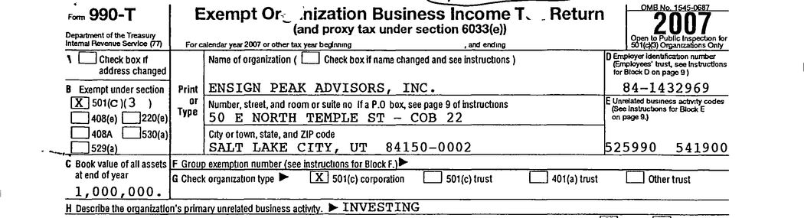

# 🗣 WSJ Interview
I've got some comments on a Wall Street Journal article, which provides some insights to the LDS Church's tithing, spending on temples, charitable giving, among other things. It's got some excerpts from interviews with presiding bishopric members. Props to the journalist Jonathan Weil who put this together. 

The direct source for the 2023 article [can be found here](https://www.wsj.com/articles/mormon-church-temple-spending-spree-utah-e167977f). If you're an absolute madman, you can pay money for something to read on the internet, or you could check some archived versions ([1](https://archive.ph/eXtuj), [2](https://archive.is/20230724125802/https://www.wsj.com/articles/mormon-church-temple-spending-spree-utah-e167977f))

I'll include here some excerpts from the article that I found particularly noteworthy.

&nbsp;

## Notes
> *A whistleblower revealed a few years ago that the [Church of Jesus Christ of Latter-day Saints had an estimated $100 billion investment portfolio](https://archive.is/o/BbqbV/https://www.wsj.com/articles/the-mormon-church-amassed-100-billion-it-was-the-best-kept-secret-in-the-investment-world-11581138011), and ==at the time==, church officials called the holdings a rainy-day account.*

At the time? Did they change the rationale for cosplaying Smaug after being caught?

&nbsp;

> *“We have a vision of the church that is—can I use the word grandiose?” said Gérald Caussé, the church’s presiding bishop, in an interview. “Because we believe the gospel has to be taken to all the world. And so we see the size of the church ==multiple times what it is now==, in the future.”*
>
> *Caussé and other church officials ==declined to discuss [details of the church’s finances](https://archive.is/o/BbqbV/https://www.wsj.com/articles/mormon-churchs-investment-arm-under-investigation-by-sec-dca77f9)==, such as the costs of building temples or the size of the church’s assets.*

Well... I suppose that would sound very optimistic if membership statistics didn't show a downward trend.

&nbsp;

> *Caussé said keeping the church’s financial information confidential is a matter of principle. “==It’s important for us that we maintain our privacy==,” he said. “==That’s a value that’s important for religion==.”*

Caussé, you and I have a very different idea of what it means to maintain privacy. If I tried to pull the shit you're doing, I'd get thrown in prison.

&nbsp;

> *The $100 billion investment portfolio first came to light in 2019, after a former fund manager at the church’s investment arm, Ensign Peak Advisors, filed a whistleblower complaint with the Internal Revenue Service.*
>
> *The former employee, David Nielsen, said Ensign Peak shouldn’t be treated as a tax-exempt charity because it ==didn’t use any of its money for religious, charitable or educational activities==.*
>
> *In February, the church and Ensign Peak agreed to fines of $1 million and $4 million, respectively, to settle Securities and Exchange Commission claims that they obscured the church’s investment holdings. The SEC alleged the church used more than a dozen hard-to-trace shell companies to ==file false disclosure reports that hid the size of its investments for almost 20 years==.*
>
> *Caussé declined to discuss details of the SEC settlement. “==We recognize mistakes, and we regret mistakes==,” he said. The church says cash from Ensign Peak helps fund its religious, charitable and educational activities. “There is no other purpose. Nobody is getting rich,” Caussé said. “Everything goes to these.”*

Mistakes? You're calling this a mistake? It's a decision that the first presidency had to make each quarter, over twenty years! I'm not accusing the church leadership of "getting rich," I'm saying there is no justifiable reason for a religious institution to have that much money sitting in an investment portfolio! End world hunger! Solve homelessness! Fund yourself a better PR department!

&nbsp;

> *As the SEC requires, Ensign Peak now discloses its U.S. stockholdings—==a subset of the total==—which it valued at $46.2 billion as of March 31. ==The figure doesn’t include other types of investments, such as bonds, private equity or real estate==.*

This can't be understated; 46 billion is a *subset*.

&nbsp;

> *The church also has misstated its assets on federal tax returns. On its 2007 return, Ensign Peak put down “1,000,000” for its total assets. ==The real number was about $38,000,000,000, an Ensign Peak document shows==. In later years, ==Ensign Peak wrote “over 1,000,000” on its returns==. The church followed the same practices on its own IRS returns, where it reports business income unrelated to its tax-exempt mission.*

{: .center}
*ayyy don't worry so much, it was only off by 37,999,000,000.*

But don't worry, they recognize mistakes and regret mistakes.

&nbsp;

> *Church officials said ==they believe that, as a religious organization, the church doesn’t have to disclose its assets==. Todd Budge, another member of the presiding bishopric, said anyone familiar with the church would know its assets exceeded $1 million. “==It wasn’t an accurate answer. It wasn’t meant to be an accurate answer==,” said Budge, a 63-year-old former banking and private-equity executive. “==It was simply meant to communicate that we do not feel that we’re obligated to fill in that box.==”*

**THAT'S NOT HOW TAXATION LAWS WORK, TODD**

Are you saying that the IRS should be counted among those "familiar with the church" who "would know its assets exceeded $1 million"? You are a former banking and private-equity executive, for Christ's sake. You are not doing this out of ignorance. You are not being cheeky and coy about this. This is not a guessing game. *You are literally breaking federal laws*.

&nbsp;

The last bit I have notes in is pertaining to charitable donations, which I'll put in its [[Charitable Giving#WSJ Interview Excerpt|proper page and section]].

As I understand the risk factors of investing, one shouldn't invest money that they can't afford to lose entirely. Stock market could crash and it'd all go away. Assuming this conventional wisdom scales into billions, the church could shrug off a $46 billion loss. How much money would they have to have stashed elsewhere to have that sense of confidence?